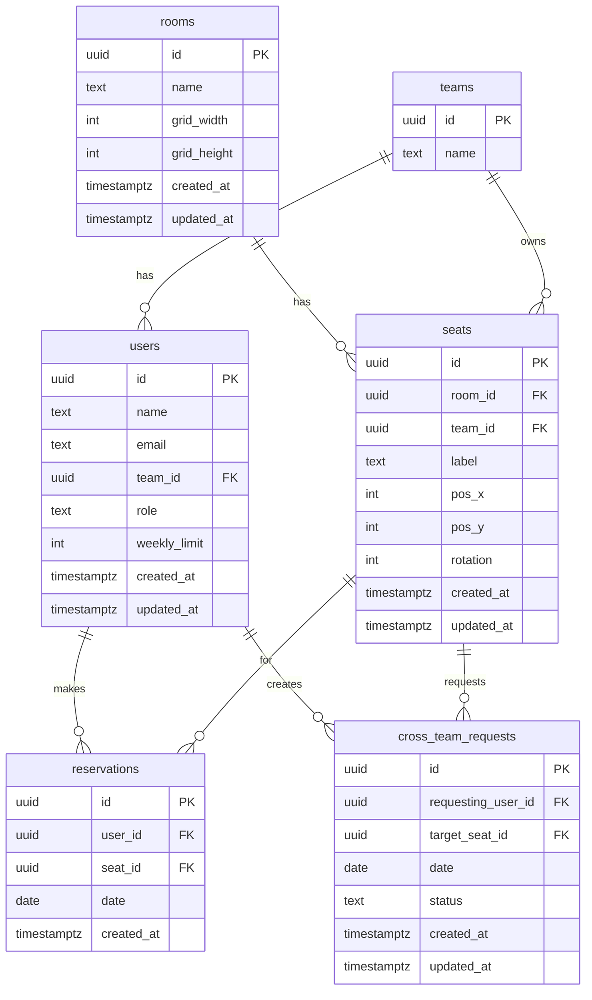

# Database Schema

## ER Diagram

## Table Details

### rooms

| Column | Type | Constraints |
|--------|------|-------------|
| id | UUID | PK, default `gen_random_uuid()` |
| name | TEXT | NOT NULL |
| grid_width | INT | NOT NULL, CHECK > 0 |
| grid_height | INT | NOT NULL, CHECK > 0 |
| created_at | TIMESTAMPTZ | NOT NULL, default `now()` |
| updated_at | TIMESTAMPTZ | NOT NULL, default `now()` |

### teams

| Column | Type | Constraints |
|--------|------|-------------|
| id | UUID | PK, default `gen_random_uuid()` |
| name | TEXT | NOT NULL, UNIQUE |

### users

| Column | Type | Constraints |
|--------|------|-------------|
| id | UUID | PK, default `gen_random_uuid()` |
| name | TEXT | NOT NULL |
| email | TEXT | NOT NULL, UNIQUE |
| team_id | UUID | FK → teams(id) |
| role | TEXT | NOT NULL, CHECK IN (`superadmin`, `team_admin`, `viewer`) |
| weekly_limit | INT | NOT NULL, default 2 |
| created_at | TIMESTAMPTZ | NOT NULL, default `now()` |
| updated_at | TIMESTAMPTZ | NOT NULL, default `now()` |

### seats

| Column | Type | Constraints |
|--------|------|-------------|
| id | UUID | PK, default `gen_random_uuid()` |
| room_id | UUID | NOT NULL, FK → rooms(id) ON DELETE CASCADE |
| team_id | UUID | NOT NULL, FK → teams(id) |
| label | TEXT | NOT NULL |
| pos_x | INT | NOT NULL |
| pos_y | INT | NOT NULL |
| rotation | INT | NOT NULL, default 0, CHECK IN (0, 90, 180, 270) |
| created_at | TIMESTAMPTZ | NOT NULL, default `now()` |
| updated_at | TIMESTAMPTZ | NOT NULL, default `now()` |
| | | UNIQUE (room_id, pos_x, pos_y) |

### reservations

| Column | Type | Constraints |
|--------|------|-------------|
| id | UUID | PK, default `gen_random_uuid()` |
| user_id | UUID | NOT NULL, FK → users(id) |
| seat_id | UUID | NOT NULL, FK → seats(id) |
| date | DATE | NOT NULL |
| created_at | TIMESTAMPTZ | NOT NULL, default `now()` |
| | | UNIQUE (seat_id, date) |

### cross_team_requests

| Column | Type | Constraints |
|--------|------|-------------|
| id | UUID | PK, default `gen_random_uuid()` |
| requesting_user_id | UUID | NOT NULL, FK → users(id) |
| target_seat_id | UUID | NOT NULL, FK → seats(id) |
| date | DATE | NOT NULL |
| status | TEXT | NOT NULL, default `pending`, CHECK IN (`pending`, `approved`, `rejected`) |
| created_at | TIMESTAMPTZ | NOT NULL, default `now()` |
| updated_at | TIMESTAMPTZ | NOT NULL, default `now()` |
| | | UNIQUE (target_seat_id, date, requesting_user_id) |

## Business Rules (enforced by schema)

- **One seat per day**: `reservations` has `UNIQUE (seat_id, date)`.
- **Unique grid position**: `seats` has `UNIQUE (room_id, pos_x, pos_y)`.
- **No duplicate team names**: `teams.name` is UNIQUE.
- **No duplicate emails**: `users.email` is UNIQUE.
- **One cross-team request per user per seat per date**: `UNIQUE (target_seat_id, date, requesting_user_id)`.
- **Cascade delete**: Deleting a room removes all its seats (and by extension, their reservations via FK cascade).
- **Optional team membership**: `users.team_id` is nullable (superadmins may have no team).
